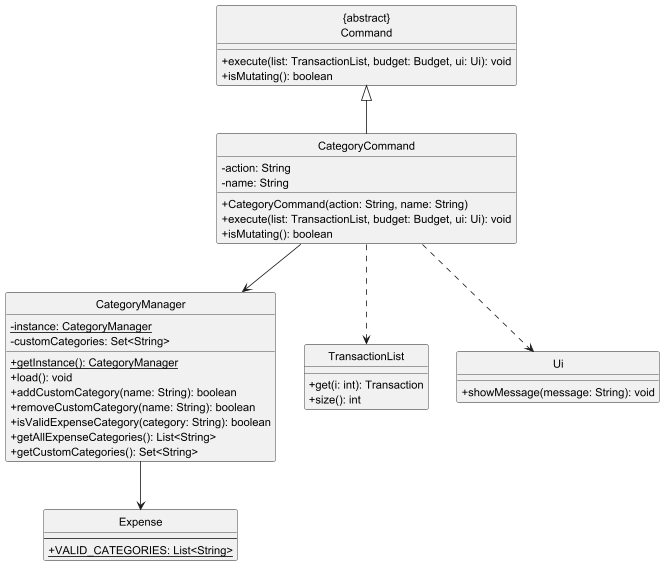
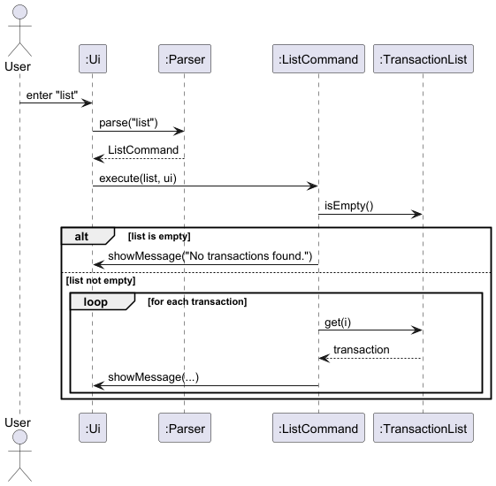
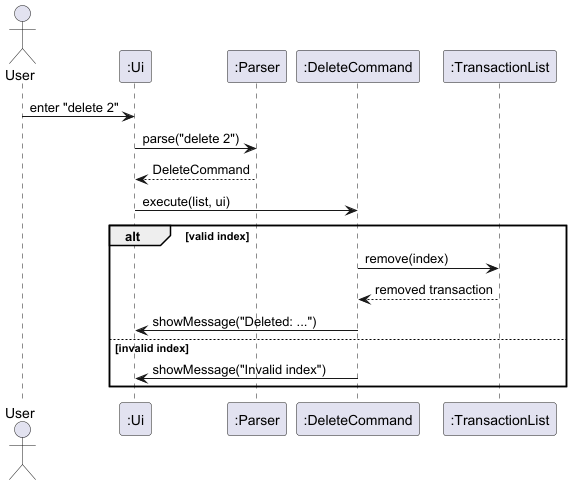
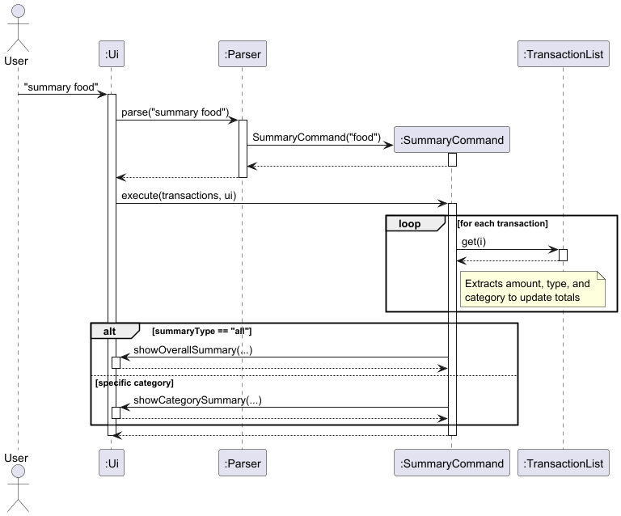
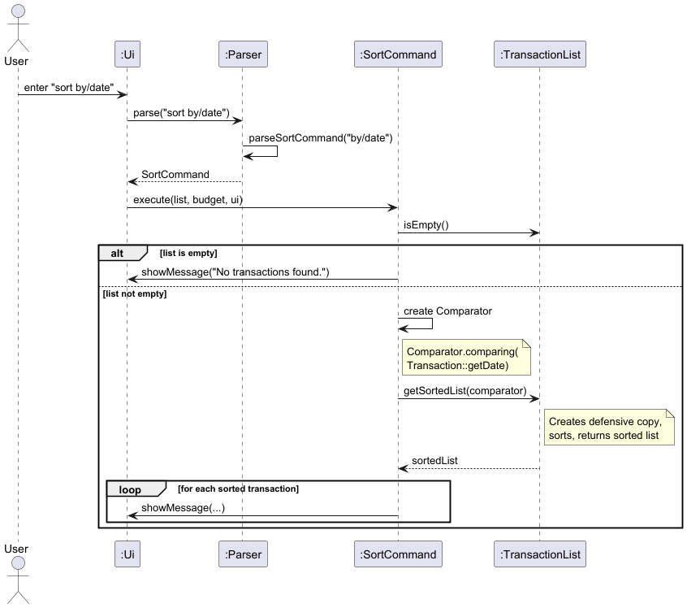
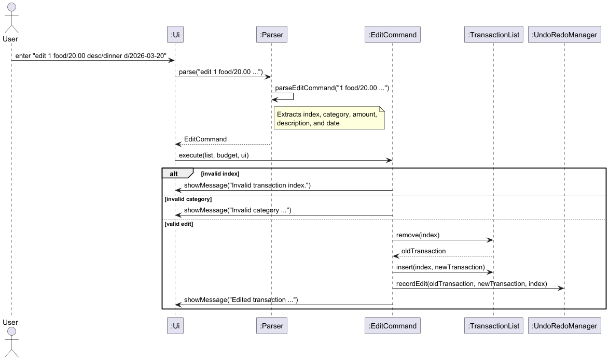
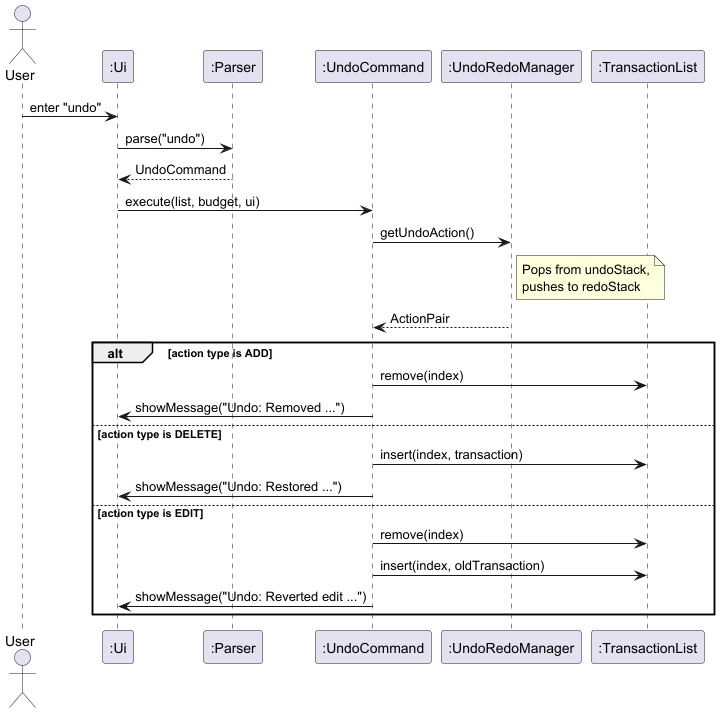
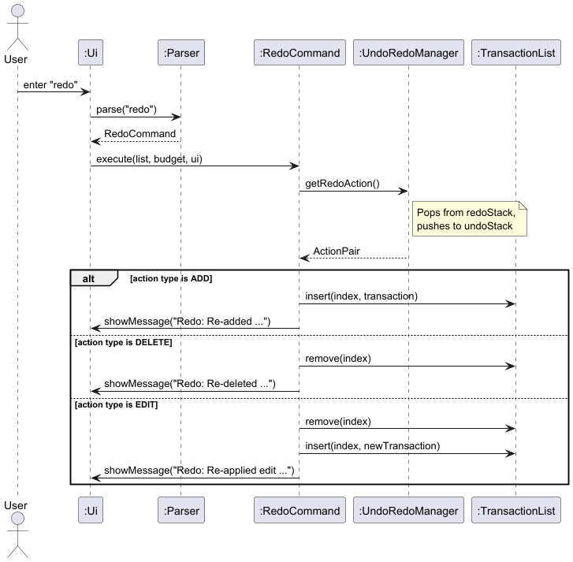
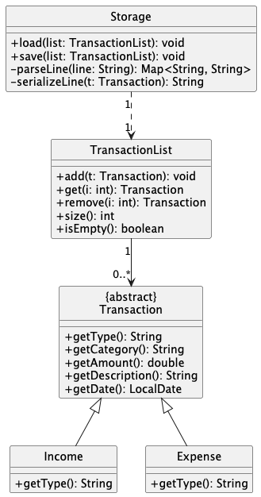
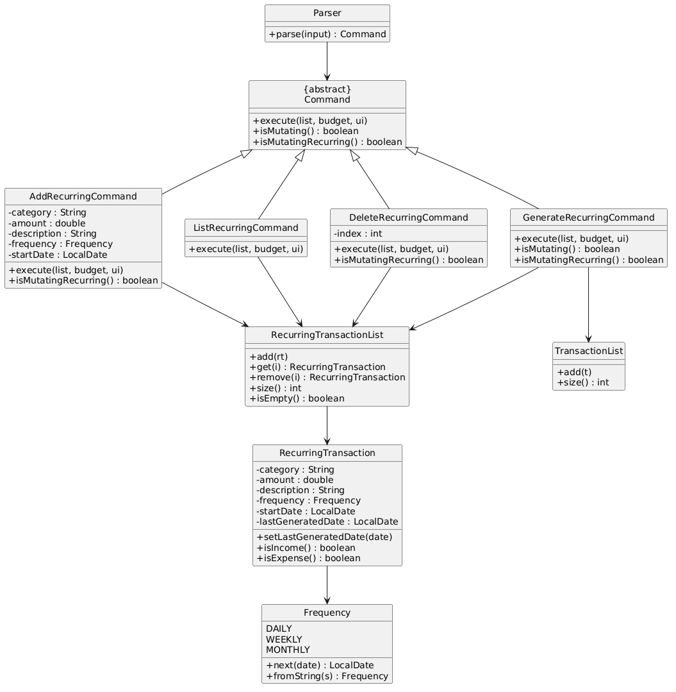

# Developer Guide

## Acknowledgements

{list here sources of all reused/adapted ideas, code, documentation, and third-party libraries -- include links to the original source as well}

## Design & implementation

# Design

## Architecture

(Overall system architecture diagram and explanation)

## Components
### Parser
### Command
### Ui
### Transaction

The `Transaction` class is the abstract base class shared by all transaction types in the application.
It defines the common fields and accessor methods that `Income` and `Expense` both inherit, and
declares the abstract `getType()` method that each subclass must implement to identify itself at runtime.

### Class Diagram


**Fields defined in `Transaction`:**

| Field | Type | Description |
|---|---|---|
| `category` | `String` | The category label for the transaction |
| `amount` | `double` | The monetary value (must be positive) |
| `description` | `String` | An optional description string |
| `date` | `LocalDate` | The date of the transaction |

All fields are declared `protected final`, making them accessible to subclasses but immutable after construction.
This immutability is intentional — rather than modifying a transaction in place, the `EditCommand` removes
the old transaction and inserts a newly constructed one at the same index.

**Abstract method:**
- `getType()` — returns a lowercase string identifying the transaction type (e.g. `"income"` or `"expense"`).
  This is used by `SummaryCommand` to distinguish income from expense entries without relying on `instanceof` checks.

## Expense Class

### Overview
The `Expense` class represents an expenditure transaction in the application.
It extends the abstract `Transaction` class alongside `Income`, and is one of the two concrete
transaction types that can be stored in the `TransactionList`.

### Design
`Expense` enforces a fixed set of valid categories defined as a static list:

| Category   | Description |
|------------|---|
| `food`     | Meals and groceries |
| `transport` | Commuting and travel costs |
| `utilities` | Bills such as electricity and water |
| `education` | Tuition, books, and course fees |
| `rent`     | Accommodation payments |
| `medical`  | Healthcare and pharmacy costs |
| `misc`     | Any other expenditure |

Logging is configured at `WARNING` level to reduce noise during normal operation, matching the
convention used by `Income` and `TransactionList`.

### Key Methods
- `getType()` — returns `"expense"`, used to distinguish transaction types at runtime without `instanceof` checks.
- `toString()` — formats the transaction for display
  (e.g. `[Expense] food "lunch" $12.50 (2026-03-20)`). The description is omitted from the output
  if it is an empty string, keeping the display clean for transactions logged without a description.

### Design Considerations
The `Expense` and `Income` classes are intentionally kept symmetric in structure.
Both extend `Transaction` and override only `getType()` and `toString()`, keeping each subclass
minimal and focused.
Defining `VALID_CATEGORIES` as a `public static final` field on `Expense` (rather than in the
`Parser` or a separate validator) keeps the validation rules and category data together in one place.
This also allows `AddCommand` and `EditCommand` to reference 
`Expense.VALID_CATEGORIES` directly when deciding which transaction type to instantiate.

### Alternatives Considered
One alternative was to consolidate `Income` and `Expense` into a single `Transaction` class
with a `type` field (e.g. an enum of `INCOME` or `EXPENSE`). While this reduces the number of
classes, it would require all category validation and formatting logic to branch on the type field,
making the class harder to extend. The subclass approach allows each type to define its own
categories and `toString()` format independently, and adding a new transaction type in future
requires only a new subclass rather than modifying existing ones.

### Future Improvements
- Allow user-defined custom categories beyond the fixed list.
- Add sub-categories (e.g. `food/dining-out` vs `food/groceries`) for better summaries.

---

## CategoryManager

### Overview
`CategoryManager` is a singleton that manages user-defined custom expense categories alongside
the built-in ones in `Expense.VALID_CATEGORIES`. Custom categories are persisted to
`data/categories.txt` and survive across sessions.

### Design
The singleton is initialised in `main` before `Storage.load()`. This ordering is required
because `Storage` reconstructs `Expense` objects from disk, and the `Expense` constructor must
already recognise any custom categories from the previous session.

Custom categories are stored as a `LinkedHashSet<String>` (lowercase, insertion-ordered) and
written to disk using the same temp-file-then-move pattern as `Storage`.

### Class Diagram

### Key Methods

| Method                             | Description                                                  |
|------------------------------------|--------------------------------------------------------------|
| `load()`                           | Reads `data/categories.txt` on startup                       |
| `addCustomCategory(name)`          | Adds a category; returns `false` if already exists           |
| `removeCustomCategory(name)`       | Removes a category; returns `false` if not found or built-in |
| `isValidExpenseCategory(category)` | `true` if built-in or user-defined                           |
| `getAllExpenseCategories()`        | Built-ins first, then custom in insertion order              |
| `getCustomCategories()`            | Defensive copy of custom categories only                     |

### Design Considerations
- **Singleton:** `CategoryManager` is referenced inside the `Expense` constructor, which has
  no other way to receive it. Dependency injection would require changes across the entire
  constructor chain.
- **Built-ins are never written to disk:** Only user-added categories go into `categories.txt`.
  Built-ins are implicitly protected — `removeCustomCategory` only searches the custom set,
  so built-ins always return `false`.

---

### TransactionList / Storage
# Implementation

## List and Delete Transaction Feature

### Overview
The list and delete transaction features allow users to manage their transactions stored in the application.
The `list` command displays all recorded transactions in a numbered format, while the `delete` command removes a transaction based on its index.
These features improve usability by allowing users to review and remove transactions easily.

### Architecture and Flow
When a user enters a command, the input is first handled by the `Ui` component, which reads the input and passes it to the `Parser`.
The `Parser` then interprets the input and creates the appropriate `Command` object (`ListCommand` or `DeleteCommand`).
The command is executed using the `TransactionList` to retrieve or remove transactions, and the result is displayed to the user through the `Ui`.

### Sequence Diagram for List Command


### Listing Transactions
The `list` command is implemented using the `ListCommand` class.
When executed, the command checks whether the transaction list is empty using the `isEmpty()` method.
If the list is not empty, it iterates through the transactions using the `size()` and `get(int i)` methods and displays them in a numbered format.

### Sequence Diagram for Delete Command


### Deleting Transactions
The `delete` command is implemented using the `DeleteCommand` class.
The `Parser` extracts the index provided by the user and passes it to the `DeleteCommand`.
The `DeleteCommand` then removes the corresponding transaction from `TransactionList` using the `remove(int i)` method and displays a confirmation message.

### Class Diagram


### Design Considerations
This feature uses a command-based architecture to ensure separation of concerns.
The `Parser` is responsible only for parsing user input, while each command class is responsible for executing its own logic.
The `TransactionList` class manages the storage of transactions, which improves modularity and maintainability.
Assertions and logging are used in `TransactionList` as part of defensive programming to detect invalid operations and to record important actions such as adding or removing transactions.

### Alternatives Considered
One alternative was to place all command logic inside the `Parser` class using conditional statements.
However, this approach would make the `Parser` class too large and difficult to maintain as more commands are added.
Another alternative was to allow the `Ui` class to directly modify the transaction list, but this would reduce modularity and violate separation of concerns.
The chosen design using separate command classes was preferred because it improves extensibility and maintainability.

### Future Improvements
Possible future improvements include allowing deletion of multiple transactions at once, supporting filtered list views, and adding an undo feature to restore deleted transactions

---

## Find and Summary Transaction Features

### Overview
The `find` and `summary` features allow users to draw meaningful insights from their recorded transactions.
The `find` command locates specific transactions based on keyword matching, allowing users to search for distinct transactions or categories. 
The `summary` command calculates and displays the overall statistics (eg. total expense) for the user to see at a glance.

### Architecture and Flow
Similar to the broader application architecture, these features rely on the interaction between the `Parser`, `Command`, `TransactionList`, and `Ui` components.
1. The `Parser` receives raw input (e.g., `find food` or `summary`) and instantiates either a `FindCommand` containing the target keyword, or a `SummaryCommand`.
2. Upon calling `execute()`, the respective command interacts with the `TransactionList` to either filter for matches or aggregate financial data.
3. The computed results are formatted and printed to the user via the `Ui`.

### Finding Transactions
The `find` command is encapsulated within the `FindCommand` class. 
During execution, the method iterates through the current list, comparing the target keyword against the description of each transaction.

#### Sequence Diagram for Find Command
The following sequence diagram illustrates the precise object interactions when a user searches for a keyword.


### Summarizing Transactions
The `summary` command is handled by the `SummaryCommand` class. 
It performs computations over the list of transactions. 
It iterates through the entire `TransactionList`, categorising each entry as either an Income or an Expense, and sums the respective totals before calculating the net balance.

#### Sequence Diagram for Summary Command
The following sequence diagram illustrates the interactions when a user wants to see a summary of their transactions.


### Class Diagram
Both commands adhere to the application's Command pattern structure. The diagram below shows how `FindCommand` and `SummaryCommand` inherit from the abstract `Command` class and depend on `TransactionList` and `Ui`.


### Design Considerations
* **Case-Insensitive Searching:** For the `find` feature, it was decided that keyword matching should be case-insensitive (e.g., searching "food" returns "Food" and "FOOD"). This greatly enhances user experience, as users do not need to remember the exact capitalization of their previous entries.
* **Stream-Based Indexing:** A major design consideration was how to display matching transactions alongside their original indices from the main list. Instead of iterating through the list and keeping a separate counter, IntStream.range(0, list.size()) was used.

### Alternatives Considered
* **Alternative for Summary:** We considered caching the total income and expense values inside `TransactionList`, updating them dynamically every time an item is added or deleted. While this makes the `summary` command run in O(1) time, it heavily complicates the `add` and `delete` operations and introduces state-synchronization bugs. The O(N) calculation upon execution was chosen for stability and simplicity.

### Future Improvements
* **Time-Bound Summaries:** Upgrading the `summary` command to accept date parameters, allowing users to see summaries for specific months or weeks (e.g., `summary /from 2026-01-01 /to 2026-01-31`).

---

## Sort Transaction Feature

### Overview
The `sort` command allows users to view their transactions ordered by date, amount, or category,
without modifying the underlying list order. It is a read-only operation that creates a temporary
sorted copy purely for display.

### Architecture and Flow
When the user enters a sort command (e.g., `sort by/date`), the input is passed from the `Ui`
to the `Parser`. The `Parser` calls `parseSortCommand()`, which validates the `by/` prefix and
the criteria string. A `SortCommand` is created with the validated criteria and returned to the
main loop. During execution, `SortCommand` constructs an appropriate `Comparator<Transaction>`,
calls `TransactionList.getSortedList(comparator)` to obtain a sorted defensive copy, and displays
the results through the `Ui`.

### Sequence Diagram
The following sequence diagram illustrates the interaction when a user sorts transactions by date.



### Implementation Details
- **Parsing:** `Parser.parseSortCommand()` validates the `by/` prefix and checks the criteria
  against the three accepted values: `"date"`, `"amount"`, and `"category"`. Any other value
  throws a `MoneyBagProMaxException`.
- **Comparator selection:** `SortCommand.execute()` uses a `switch` statement to build the
  appropriate comparator:
  - `date` — `Comparator.comparing(Transaction::getDate)` (ascending, earliest first)
  - `amount` — `Comparator.comparingDouble(Transaction::getAmount).reversed()` (descending,
    largest first)
  - `category` — `Comparator.comparing(Transaction::getCategory, String.CASE_INSENSITIVE_ORDER)`
    (alphabetical, case-insensitive)
- **Non-mutating:** `TransactionList.getSortedList()` copies the list into a new `ArrayList`,
  sorts the copy using `Collections.sort()`, and returns it. The original `TransactionList` is
  never modified. `SortCommand` does not override `isMutating()`, so it inherits `false` from
  the base `Command` class — no auto-save is triggered after execution.

### Class Diagram


### Design Considerations
- **Non-mutating design:** The sort command deliberately returns a sorted copy rather than sorting
  the list in place. This preserves the user's insertion order and avoids corrupting the indices
  stored by `UndoRedoManager`. If sort modified the list order, previously recorded undo/redo
  indices would point to the wrong transactions, breaking the undo/redo feature.
- **Leveraging Java standard library:** Using `Comparator` method references and
  `Comparator.comparing()` avoids hand-written comparison logic, which is verbose and prone to
  sign errors. The standard library comparators are well-tested and handle edge cases (e.g., null
  dates) more robustly.
- **`isMutating()` returns false:** Because the original list is unchanged, no storage save is
  needed after sort. This is an intentional contract with the main loop — sort is a view command,
  not a data command.

### Alternatives Considered
- **In-place sort with an "unsort" command:** Sorting the actual list is simpler to implement but
  destroys the insertion order that `UndoRedoManager` relies on. Providing an "unsort" command to
  restore original order would require persisting the original order separately, significantly
  increasing complexity. The defensive-copy approach was chosen for simplicity and correctness.
- **Caching the sorted result:** Storing the last sort result in `TransactionList` could avoid
  re-sorting on repeated calls. However, any add/delete/edit operation would stale the cache,
  requiring cache-invalidation logic. Since the list is small for a personal finance app and
  sorting is O(n log n), this optimization was deemed unnecessary.
- **Persistent sort order:** An alternative was to make sort permanently reorder the list and
  save to storage. This was rejected because users expect sort to be a display-only operation,
  not a data mutation. Making it persistent would also conflict with undo/redo index semantics.

### Future Improvements
- Support multi-key sorting (e.g., `sort by/category by/date` to sort by category then date
  within each category).
- Add an ascending/descending toggle (e.g., `sort by/amount asc`).
- Display original list indices alongside sorted results so users can reference them for
  subsequent `delete` or `edit` commands.

---

## Edit Transaction Feature

### Overview
The `edit` command allows users to replace an existing transaction in the list with new values.
Rather than modifying a transaction's fields in place, the command removes the old transaction
and inserts a newly constructed one at the same index. This is consistent with the immutability
of the `Transaction` class hierarchy, where all fields are declared `protected final`.

### Architecture and Flow
When the user enters a command such as `edit 1 food/20.00 desc/dinner d/2026-03-20`, the input
is passed from the `Ui` to the `Parser`. The `Parser` calls `parseEditCommand()`, which extracts
the 1-based target index, category, amount, optional description, and optional date. An
`EditCommand` is created with these values and returned to the main loop. During execution,
`EditCommand` validates the index bounds and resolves the category to either an `Income` or
`Expense` object. If both checks pass, the old transaction is removed, the new one is inserted
at the same position, the change is recorded in `UndoRedoManager`, and the user is shown a
before/after confirmation via `Ui`.

### Sequence Diagram
The following sequence diagram illustrates the interactions when a user edits a transaction.



### Implementation Details
- **Parsing:** `Parser.parseEditCommand()` splits the argument string to extract the index, then
  delegates to the same `parseAmount()`, `parseDescription()`, and `parseDate()` private helpers
  used by `parseAddCommand()`. Reusing these helpers ensures consistent parsing behaviour across
  both commands.
- **Category resolution:** `EditCommand.execute()` checks the category string against
  `Income.VALID_CATEGORIES` and `Expense.VALID_CATEGORIES` to decide whether to construct an
  `Income` or `Expense` object. If the category is not found in either list, an error message is
  displayed and the list is left unchanged.
- **Replace instead of modify:** The old transaction is removed with `TransactionList.remove(index)`,
  which returns the removed object. The new transaction is then immediately inserted at the same
  index with `TransactionList.insert(index, newTransaction)`. Because removal and insertion always
  happen together, the list size and all other indices remain stable throughout.
- **Undo/Redo integration:** After a successful edit, `UndoRedoManager.recordEdit()` is called
  with both the old and new transactions and the list index. This allows `UndoCommand` to restore
  the original transaction and `RedoCommand` to reapply the replacement. See the
  [Undo and Redo Feature](#undo-and-redo-feature) section for how `EDIT` actions are reversed.
- **Auto-save trigger:** `EditCommand` inherits `isMutating()` returning `true` from the base
  `Command` class, which triggers auto-save to storage after execution.

### Design Considerations
- **Immutable replacement:** The `Transaction` class declares all fields
  `protected final`, so editing a transaction requires constructing a new object rather than
  updating fields. This immutability simplifies reasoning about transaction state, eliminates the
  risk of partial updates, and aligns naturally with how `UndoRedoManager` stores snapshots.
- **Shared parsing helpers:** Reusing `parseAmount()`, `parseDescription()`, and `parseDate()`
  between `parseAddCommand()` and `parseEditCommand()` avoids duplicating parsing logic. Any
  future change to how amounts, descriptions, or dates are parsed will automatically apply to
  both commands.
- **Validation before modification:** Both the index bounds check and the category validation
  occur before any list modification. This ensures the list is never left in a partially-edited
  state if either check fails.

### Alternatives Considered
- **Delegating to `DeleteCommand` + `AddCommand`:** Composing an edit from an existing delete
  followed by an add would reuse existing logic, but would push two actions onto the undo stack
  instead of one — meaning the user would need to undo twice to revert a single edit. The
  dedicated `EditCommand` with `recordEdit()` keeps the undo stack accurate.

### Future Improvements
- Support partial edits (e.g., `edit 1 desc/new-description`) to update a single field without
  having to re-enter the amount, category, and date.

---

## Undo and Redo Feature

### Overview
The `undo` and `redo` commands allow users to reverse and reapply the last mutating operation
(add, delete, or edit). They provide a safety net against accidental changes. The feature uses
a dual-stack pattern: an undo stack records performed actions and a redo stack records undone
actions, enabling bidirectional navigation of the action history.

### Architecture and Flow
`UndoRedoManager` is instantiated once in `MoneyBagProMax` (the main class) and injected into
the `Parser`. When a mutating command (`AddCommand`, `DeleteCommand`, `EditCommand`) executes,
it calls the appropriate `record*()` method on `UndoRedoManager`, which pushes an `ActionPair`
onto the undo stack and clears the redo stack. When the user types `undo`, the `Parser` creates
an `UndoCommand` that holds a reference to the shared `UndoRedoManager`. During execution,
`UndoCommand` pops the top action from the undo stack, pushes it onto the redo stack, and applies
the inverse operation to `TransactionList`. `redo` works symmetrically.

### Sequence Diagram for Undo Command
The following diagram shows the full interaction when a user undoes a previous action.



### Sequence Diagram for Redo Command
The following diagram shows the full interaction when a user redoes a previously undone action.



### Implementation Details
- **Recording actions:** Each mutating command calls `recordAdd()`, `recordDelete()`, or
  `recordEdit()` on `UndoRedoManager` after modifying the list. Each method creates an
  `ActionPair` capturing the action type, the affected transaction(s), and the list index,
  then clears the redo stack to invalidate any future redo history.
- **ActionPair:** An inner static class of `UndoRedoManager` that stores:
  - `ActionType` enum (`ADD`, `DELETE`, `EDIT`)
  - `transaction` — the transaction that was added/deleted, or the new version after an edit
  - `oldTransaction` — the previous version before an edit (null for ADD and DELETE)
  - `index` — the position in the list at the time the action was performed
- **Undo logic:** `UndoCommand.execute()` calls `getUndoAction()`, which pops from the undo
  stack and pushes onto the redo stack. The command then switches on the action type to perform
  the inverse operation:
  - `ADD` → `list.remove(index)` (removes the added transaction)
  - `DELETE` → `list.insert(index, transaction)` (re-inserts the deleted transaction)
  - `EDIT` → `list.remove(index)` then `list.insert(index, oldTransaction)` (restores
    the pre-edit version)
- **Redo logic:** `RedoCommand.execute()` calls `getRedoAction()`, which pops from the redo
  stack and pushes onto the undo stack. The command then reapplies the original action:
  - `ADD` → `list.insert(index, transaction)`
  - `DELETE` → `list.remove(index)`
  - `EDIT` → `list.remove(index)` then `list.insert(index, transaction)`
- **Mutating flag:** Both `UndoCommand` and `RedoCommand` override `isMutating()` to return
  `true`, which triggers auto-save to storage after execution.

### Class Diagram


### Design Considerations
- **Dual-stack delta vs. Memento pattern:** The Memento pattern stores a complete copy of the
  entire `TransactionList` before each mutating action. While straightforward, this uses O(n)
  memory per recorded action, where n is the list size. The dual-stack approach stores only the
  delta — the action type, one or two transaction objects, and an index — using O(1) memory per
  action. For a personal finance app where sessions may involve many operations, the delta approach
  is more memory-efficient.
- **Clearing the redo stack on new action:** When a new mutating action occurs after one or more
  undos, the redo stack is cleared. This follows the standard undo/redo contract used by text
  editors: branching redo history (where redo could replay an action conflicting with newer
  changes) is avoided by discarding the redo stack. The result is a linear, predictable history.
- **Index-based reinsertion:** Storing the exact list index allows transactions to be restored to
  their original position. This is correct because undo/redo is strictly LIFO — the most recent
  action must be undone before earlier ones, which guarantees that stored indices remain valid
  during sequential undo/redo sequences.
- **Non-persistent history:** Undo/redo stacks are in-memory only and cleared on application
  exit. Persisting them would require serializing `ActionPair` objects across sessions, with
  the risk of stale references if the saved data file is modified externally. For a CLI app,
  this complexity is disproportionate to the benefit.

### Alternatives Considered
- **Memento pattern (full state snapshots):** Store a complete copy of `TransactionList` before
  each mutating action and restore the snapshot on undo. Advantage: simpler undo logic (just
  swap the reference). Disadvantage: O(n) memory per action, and deep-copying `Transaction`
  objects for every add/delete/edit is costly. Rejected due to memory overhead.
- **Command pattern with per-command undo methods:** Add an `undo()` method to each command
  class (e.g., `AddCommand.undo()` removes the added transaction). This couples undo logic
  directly to each command class, spreading the responsibility across many files and making
  it harder to add new commands. The chosen design centralises all undo/redo logic in
  `UndoRedoManager` and two command classes.
- **Single list with an index pointer:** Maintain one list of `ActionPair` objects with a
  pointer that moves backward on undo and forward on redo. This is functionally equivalent to
  the dual-stack approach but is less intuitive conceptually — the dual-stack model maps more
  directly to the standard mental model of "undo history" and "redo history" as separate queues.

### Future Improvements
- Set a maximum undo history size (e.g., 50 actions) to bound memory usage in long sessions.
- Persist undo/redo history to a separate file so it survives application restarts.
- Add `undo N` syntax to undo multiple actions in a single command.
- Add a `history` command to list available undo/redo operations so users can see what actions
  are available before committing to an undo.

## Income Class

### Overview
The `Income` class represents an income transaction in the application.
It extends the abstract `Transaction` class, alongside `Expense`, sharing common fields: `category`, `amount`, `description`, and `date`.

### Design
`Income` enforces a fixed set of valid categories defined as a static list:

| Category | Description |
|---|---|
| `salary` | Regular employment income |
| `freelance` | Contract or freelance work |
| `investment` | Returns from investments |
| `business` | Business revenue |
| `gift` | Monetary gifts received |
| `misc` | Any other income |

Category validity is enforced via an assertion in the constructor, consistent with the defensive programming approach used elsewhere in the codebase.
Logging is configured at `WARNING` level to reduce noise during normal operation.

### Key Methods
- `getType()` — returns `"income"`, used to distinguish transaction types polymorphically at runtime.
- `toString()` — formats the transaction for display (e.g. `[Income] salary "June paycheck" $3000.00 (2026-06-01)`).

### Design Considerations
The `Income` and `Expense` classes are intentionally kept symmetric in structure.
Both extend `Transaction` and override `getType()` and `toString()`, making it straightforward to introduce new transaction types in future by simply extending `Transaction` and implementing these methods.
Keeping the valid category list as a `static final` field on the class (rather than in the `Parser` or elsewhere) ensures validation logic stays close to the data it governs.

### Alternatives Considered
One alternative was to represent transaction types using an enum field on a single `Transaction` class rather than separate subclasses.
However, using subclasses allows each type to define its own valid categories and formatting logic independently, which is more extensible as the application grows.

### Future Improvements
- Allow user-defined custom categories beyond the fixed list.
- Add support for recurring income entries (e.g. monthly salary auto-logged).

---

## Persistent Storage Feature

### Overview
The persistent storage feature allows transactions to be saved across sessions so that user data is not lost when the application exits.
The `Storage` class is responsible for reading from and writing to a flat file (`data/transactions.txt`) on disk.
It is invoked on startup to reload saved transactions, and after every mutating command to persist the latest state.

### Architecture and Flow
The `Storage` class operates independently of the command pipeline and is called directly by the main application loop.
On startup, `Storage.load()` reads the data file line by line, parses each transaction record, and populates the `TransactionList`.
After any command that modifies the list (add, delete, etc.), `Storage.save()` serializes the entire `TransactionList` back to disk atomically using a temporary file, replacing the previous file only once the write succeeds.

### Sequence Diagram for Load


### Loading Transactions
On startup, `load()` ensures the `data/` directory and `transactions.txt` file exist, creating them if necessary.
It then reads all lines from the file, skipping any that do not begin with the `[TXN]` prefix.
Each valid line is parsed by `parseLine()` into a key-value map of fields (`type`, `category`, `amount`, `description`, `date`).
The appropriate `Transaction` subclass — either `Income` or `Expense` — is instantiated and added to the `TransactionList`.
Malformed lines are skipped with a warning rather than halting the application, so a single corrupt entry does not prevent the rest of the data from loading.

### Sequence Diagram for Save


### Saving Transactions
`save()` serializes every transaction in the list into a pipe-delimited string via `serializeLine()`, producing lines of the form:
```
[TXN] | type=income | category=food | amount=12.5 | description=lunch | date=2026-03-25
```
The lines are first written to a temporary file (`transactions.txt.tmp`), which is then atomically moved to replace `transactions.txt`.
This two-step write ensures that a crash or interruption during saving cannot corrupt the existing data file.

### Class Diagram


### Design Considerations
The `Storage` class is decoupled from the command classes and interacts only with `TransactionList`, keeping concerns cleanly separated.
Atomic saves via a temporary file were chosen to protect data integrity — a partial write leaves the previous file intact.
The pipe-delimited `[TXN] | key=value` format is human-readable and easy to extend with new fields without breaking backward compatibility, since fields are parsed by name rather than by position.
Assertions are used throughout to enforce preconditions such as non-null inputs and positive amounts, consistent with the defensive programming approach used elsewhere in the codebase.

### Alternatives Considered
One alternative was to store transactions in JSON format, which would provide a more structured and widely recognised data format. However, this would require importing a third-party JSON library, introducing an external dependency for a task that a simple custom parser can handle adequately.
Another alternative was a database such as SQLite, but this was considered overkill for an application that only needs to persist a flat list of transactions with no relational queries.
The plain-text pipe-delimited format was chosen for its simplicity, zero external dependencies, and ease of manual inspection or editing if needed.

### Future Improvements
Possible future improvements include supporting multiple save files or profiles, compressing the data file for large transaction histories, and adding a backup rotation strategy to retain recent snapshots in case of data corruption.

---

## Export Feature

### Overview
The export feature allows users to export their transaction data to an external file for use outside the application.
Two export formats are supported: CSV (via `CsvExporter`) and TXT (via `TextFileExporter`).
Both exporters are located in the `seedu.duke.storage` package alongside the `Storage` class.

### CSV Export — `CsvExporter`
`CsvExporter.export(TransactionList list, String outputPath)` iterates over the `TransactionList` and writes a CSV file to the specified output path.
The first line of the file is always the header row: `date,type,category,description,amount`.
Each subsequent line corresponds to one transaction, with fields serialized in the same order as the header.
Values that contain commas, double quotes, or newlines are wrapped in double quotes and have any internal double quotes escaped by doubling them, following standard CSV escaping rules.
If the write fails, a `MoneyBagProMaxException` is thrown with the underlying I/O error message.

The output is intended for consumption by CSV-compatible programs such as spreadsheet applications, or for data interchange between tools.

### TXT Export — `TextFileExporter`
`TextFileExporter.export(String outputPath)` copies the existing `data/transactions.txt` file directly to the specified output path using `StandardCopyOption.REPLACE_EXISTING`.
The output file is in the same pipe-delimited `[TXN]` format used internally by `Storage`, making it suitable for loading into another instance of MoneyBagProMax.
If the source data file does not exist, a `MoneyBagProMaxException` is thrown. I/O failures during the copy are also surfaced as `MoneyBagProMaxException`.

### Design Considerations
The two exporters are intentionally kept separate rather than unified under a single export interface.
`CsvExporter` operates on the in-memory `TransactionList` and constructs the output programmatically, while `TextFileExporter` operates directly on the data file on disk.
This distinction reflects their different purposes: CSV export is for interoperability with external programs, while TXT export is for portability between instances of the application.
Neither exporter modifies any application state, so they do not implement `isMutating()` and do not trigger a save of `transactions.txt`.

### Alternatives Considered
A single unified exporter with a format parameter was considered, but rejected because the two exporters have fundamentally different data sources — one reads from memory, the other from disk — making a shared abstraction awkward without adding unnecessary complexity.
JSON was considered as an additional export format but was excluded for the same reason as in the storage design: it would require a third-party library dependency.

### Future Improvements
Possible future improvements include adding an export command accessible from the REPL so users can trigger exports without restarting the application, supporting custom output field selection for CSV exports, and adding a JSON export format if a suitable zero-dependency serializer is introduced elsewhere in the codebase.

---

## Recurring Transactions Feature

### Overview
The recurring transactions feature lets users define a transaction template that fires automatically
on a schedule (daily, weekly, or monthly). Instead of entering the same expense or income entry
repeatedly, the user creates a template once; MoneyBagProMax then generates the corresponding
`Income` or `Expense` entries for every due date, both on startup and on demand via `gen-rec`.

The four commands are: `add ... rec/FREQUENCY` (create template), `list-rec` (view templates),
`delete-rec INDEX` (remove template), and `gen-rec` (trigger generation manually).

### Class Diagram


### Architecture and Flow

The feature adds two new packages alongside the existing ones:
- **Model** — `RecurringTransaction` and `Frequency` in `transaction/`
- **List** — `RecurringTransactionList` in `transactionlist/`
- **Commands** — `AddRecurringCommand`, `ListRecurringCommand`, `DeleteRecurringCommand`,
  `GenerateRecurringCommand` in `command/`

The main application loop (`MoneyBagProMax`) owns a single `RecurringTransactionList` instance.
On startup it calls `storage.loadRecurring()` to hydrate the list from disk, then immediately
runs `GenerateRecurringCommand` to materialise any pending transactions before the REPL begins.
After every command, the loop checks `command.isMutating()` (save `transactions.txt`) and
`command.isMutatingRecurring()` (save `recurring.txt`) independently.

### Implementation Details

#### RecurringTransaction model
`RecurringTransaction` is **not** a subclass of `Transaction`. It is a template object that holds
the parameters needed to generate concrete `Income` or `Expense` entries:

| Field | Type | Description |
|---|---|---|
| `category` | `String` | Category label (determines income vs. expense) |
| `amount` | `double` | Fixed monetary value for every generated entry |
| `description` | `String` | Optional label copied to every generated entry |
| `frequency` | `Frequency` | How often to generate (DAILY / WEEKLY / MONTHLY) |
| `startDate` | `LocalDate` | First date a transaction should be generated |
| `transactionType` | `String` | `"income"` if category is in `Income.VALID_CATEGORIES`, else `"expense"` |
| `lastGeneratedDate` | `LocalDate` | Most recent date a transaction was generated; `null` if never run |

All fields except `lastGeneratedDate` are `final`. `setLastGeneratedDate()` is the only mutator
and is called by `GenerateRecurringCommand` after each generated entry to advance the watermark.

#### Frequency enum
`Frequency` has three values: `DAILY`, `WEEKLY`, `MONTHLY`. Two methods drive the feature:
- `fromString(String s)` — case-insensitive parse; throws `MoneyBagProMaxException` for unknown values.
- `next(LocalDate date)` — advances a date by one period using `LocalDate.plusDays(1)`,
  `plusWeeks(1)`, or `plusMonths(1)` respectively. This handles month-length differences correctly.

#### RecurringTransactionList
A thin wrapper around `ArrayList<RecurringTransaction>` with the same interface as `TransactionList`
(`add`, `get`, `remove`, `size`, `isEmpty`). Assertions guard index bounds; logging is at WARNING
level, matching the convention used by `TransactionList`.

#### Commands

##### Sequence Diagram — add ... rec/FREQUENCY


##### Sequence Diagram — gen-rec


**AddRecurringCommand** validates the category against `Income.VALID_CATEGORIES`,
`Expense.VALID_CATEGORIES`, and any custom categories managed by `CategoryManager`. If valid,
it constructs a `RecurringTransaction` and appends it to `RecurringTransactionList`.
`isMutatingRecurring()` returns `true` so the recurring list is persisted after execution.

**ListRecurringCommand** iterates `RecurringTransactionList` and prints each template with a
1-based index. If the list is empty it shows an informational message. It does not mutate state.

**DeleteRecurringCommand** removes a template by 1-based index. It validates the index bounds
and confirms deletion via `Ui`. Crucially, it only removes the template — any `Income` or
`Expense` entries that were already generated from the template remain in `TransactionList`.
`isMutatingRecurring()` returns `true`.

**GenerateRecurringCommand** is the core of the feature. Its `execute()` method:
1. Gets today's date via `LocalDate.now()`.
2. For each template in `RecurringTransactionList`:
   - Determines `nextDate`: `startDate` if `lastGeneratedDate` is `null`, otherwise
     `frequency.next(lastGeneratedDate)`.
   - Enters a `while (!nextDate.isAfter(today))` loop:
     - Creates an `Income` or `Expense` at `nextDate` via `createTransaction()`.
     - Adds it to `TransactionList`.
     - Calls `rt.setLastGeneratedDate(nextDate)` to advance the watermark.
     - Advances `nextDate` by one period.
3. Reports the count of generated transactions per template.

This design ensures each due date is generated exactly once: if the app is closed mid-week, the
next startup will generate all missing dates up to today without duplicates.

Both `isMutating()` and `isMutatingRecurring()` return `true` for `GenerateRecurringCommand`,
because it writes to both `TransactionList` (regular transactions) and the recurring watermarks.

#### isMutatingRecurring() contract
The base `Command` class declares `isMutatingRecurring()` returning `false`. Commands that
modify `RecurringTransactionList` — `AddRecurringCommand`, `DeleteRecurringCommand`, and
`GenerateRecurringCommand` — override it to return `true`. The main loop then calls
`storage.saveRecurring(recurringList)` only when needed, avoiding redundant disk writes.

#### Storage persistence
Recurring templates are persisted separately in `data/recurring.txt`, independent of the main
`data/transactions.txt`. Each line uses a pipe-delimited key=value format prefixed with `[REC]`:
```
[REC] | category=food | amount=10.0 | description=lunch | frequency=daily | startDate=2026-04-01 | lastGeneratedDate=2026-04-02
```
`Storage.saveRecurring()` serializes every template via `serializeRecurringLine()` and writes
atomically using a temp file (`recurring.txt.tmp` → `recurring.txt`), identical to the strategy
used for `transactions.txt`. On load, `parseRecurringLine()` splits on `|`, builds a key=value
map, and reconstructs each `RecurringTransaction`; malformed lines are skipped with a warning.

#### Auto-generation on startup
In `MoneyBagProMax.main()`, after loading both data files, the application runs:
```
new GenerateRecurringCommand(recurringList).execute(transactionList, budget, ui);
```
This ensures that any transactions that became due while the app was closed are immediately
materialised when the user opens the app, without requiring a manual `gen-rec` call.

### Design Considerations
- **Template separate from Transaction:** Keeping `RecurringTransaction` out of the `Transaction`
  hierarchy means `TransactionList` and all existing commands (`list`, `delete`, `edit`, `undo`)
  never need to handle template objects. The two lists are cleanly independent.
- **Watermark over date range:** Storing only `lastGeneratedDate` (one date per template) rather
  than a set of all generated dates uses O(1) storage per template. Correctness relies on the
  LIFO assumption: `GenerateRecurringCommand` always advances the watermark monotonically, and
  the user cannot delete individual generated transactions and re-generate them.
- **Separate save flag (`isMutatingRecurring`):** Because most commands do not touch the recurring
  list, a separate flag avoids rewriting `recurring.txt` on every add/delete of a regular
  transaction. The two files are written independently.
- **Auto-generation on startup:** Running `GenerateRecurringCommand` at launch means the user
  always sees an up-to-date transaction list without remembering to type `gen-rec`. The explicit
  `gen-rec` command is provided for users who want to force generation mid-session.

### Alternatives Considered
- **Subclassing Transaction:** Making `RecurringTransaction` extend `Transaction` would allow it
  to be stored in `TransactionList`. However, this would cause recurring templates to appear in
  `list`, `summary`, and `find` outputs, and would require all existing commands to filter them
  out. The separate list approach preserves backward compatibility with all existing commands.
- **Storing all generated dates:** Persisting a set of every generated date per template would
  allow safe regeneration after a user manually deletes a generated transaction. This was rejected
  because it is unbounded in size (a daily template running for a year produces 365 stored dates),
  and the expected use case does not require regeneration after manual deletion.

### Future Improvements
- Support an `end-date` on recurring templates so they stop automatically after a deadline.
- Integrate `GenerateRecurringCommand` into the undo/redo system so generated transactions can
  be rolled back as a single action.
- Allow editing a recurring template (currently users must delete and re-add).

---

## Budget Feature

### Overview
The budget feature allows the user to set a monthly budget and monitor current-month spending against that budget.

The feature supports two commands:
- budget set AMOUNT
- budget status

budget set stores the monthly budget amount, while budget status displays the monthly budget, total expenses for the current month, the remaining budget, and the percentage of the budget used.

### Implementation
The budget feature is implemented using a dedicated Budget model class together with BudgetCommand.

The main classes involved are:
- Parser: parses user input and returns a BudgetCommand
- BudgetCommand: executes budget-related logic
- Budget: stores the monthly budget value and provides helper calculations
- TransactionList: provides the total expense for the current month
- Ui: displays the result to the user

When the user enters a budget command, the Parser creates a BudgetCommand object.  
During execution, BudgetCommand interacts with both Budget and TransactionList, then sends the formatted result to Ui.

The current implementation treats budget tracking as a monthly feature.  
As a result, budget status calculates spending using only expense transactions whose date falls within the current month.

### Sequence Diagram for budget set


### Sequence Diagram for budget status


### Sequence Diagram Explanation
When the user enters budget set AMOUNT, the input is first read by Ui and passed to the Parser.  
The Parser returns a BudgetCommand object.  
The Ui then invokes the command’s execute(...) method.  
BudgetCommand updates the Budget object by storing the given monthly budget value.  
Finally, Ui displays a confirmation message.

When the user enters budget status, Parser again returns a BudgetCommand object.  
During execution, BudgetCommand first checks whether a budget has been set.  
If not, the user is informed that no monthly budget exists.  
Otherwise, BudgetCommand requests the current month’s total expenses from TransactionList.  
It then uses helper methods in Budget to calculate the remaining budget and percentage used before passing the result to Ui.

### Design Considerations

#### Aspect: Where to store budget data
- Option 1 (Chosen): Store budget information in a separate Budget class.
- Option 2: Store budget information directly inside TransactionList.

Option 1 was chosen because it follows the Single Responsibility Principle more closely.  
TransactionList is responsible for storing and processing transactions, while Budget is responsible for budget-related state and calculations.  
This improves modularity and reduces coupling.

#### Aspect: How to calculate budget usage
- Option 1 (Chosen): Use only expense transactions from the current month.
- Option 2: Use all expenses regardless of date.

Option 1 was chosen because the feature is explicitly intended to represent a monthly budget.  
Using all expenses would make the feature less realistic and less useful for users trying to monitor monthly spending.

### Future Improvements
Possible future enhancements include:
- supporting separate budgets for different months
- allowing the user to specify the month in budget status
- automatically warning the user when spending exceeds the monthly budget

---

## Statistics Feature

### Overview
The statistics feature allows the user to view financial analytics using the stats command.

The command provides a summary of transaction behaviour, including:
- total income
- total expense
- highest expense
- lowest expense
- highest income
- most frequent expense category
- average spending per category
- spending trend
- budget usage percentage

This feature helps users better understand their spending habits and overall financial behaviour.

### Implementation
The statistics feature is implemented mainly using StatsCommand together with helper methods in TransactionList.

The main classes involved are:
- Parser: parses the input and returns a StatsCommand
- StatsCommand: coordinates the retrieval and display of statistics
- TransactionList: computes all transaction-based statistics
- Budget: provides budget usage calculation
- Ui: displays the formatted statistics output

StatsCommand does not perform raw calculations directly.  
Instead, it requests the required values from TransactionList, which is responsible for managing transaction data.

For example, TransactionList provides methods such as:
- getTotalIncome()
- getTotalExpenses()
- getHighestExpense()
- getLowestExpense()
- getHighestIncome()
- getMostFrequentCategory()
- getAverageSpendingPerCategory()
- getSpendingTrend()

The implementation also uses HashMap to compute category frequency and average spending per category efficiently.

To reduce duplication, a helper method was introduced to generalise the logic for finding extreme transactions (e.g. highest or lowest transactions of a certain type).  
This improves maintainability and follows the DRY principle.

### Sequence Diagram for stats


### Class Diagram


### Sequence Diagram Explanation
When the user enters stats, the Ui reads the input and passes it to the Parser.  
The Parser returns a StatsCommand object.  
The Ui then invokes StatsCommand.execute(...).

StatsCommand requests a series of values from TransactionList, including total income, total expense, highest expense, lowest expense, highest income, most frequent category, average spending per category, and spending trend.

If a budget has been set, StatsCommand also retrieves the current month’s total expense from TransactionList and passes it to Budget to calculate the percentage of budget used.

Finally, StatsCommand formats the information into a statistics summary and passes it to Ui for display.

### Design Considerations

#### Aspect: Where to compute statistics
- Option 1 (Chosen): Place the statistics logic in TransactionList.
- Option 2: Compute all statistics directly in StatsCommand.

Option 1 was chosen because TransactionList already owns and manages the transaction data.  
This keeps StatsCommand focused on command execution and presentation, while data-processing responsibilities remain within the transaction component.  
This improves cohesion.

#### Aspect: Data structure used for category-based statistics
- Option 1 (Chosen): Use HashMap to track category frequency and totals.
- Option 2: Use repeated nested loops.

Option 1 was chosen because it is more efficient and easier to extend.  
It also makes the code clearer for tasks such as finding the most frequent category and computing average spending per category.

#### Aspect: Refactoring duplicated logic
- Option 1 (Chosen): Extract common logic into a helper method.
- Option 2: Keep separate loops for highest expense, lowest expense, and highest income.

Option 1 was chosen because it reduces code duplication and improves maintainability.  
The helper method hides the repeated filtering and comparison logic while still exposing a clear public API through methods such as getHighestExpense() and getLowestExpense().

### Future Improvements
Possible future enhancements include:
- adding category-specific statistics such as stats CATEGORY
- allowing users to request statistics for a specified month
- comparing statistics across months
- presenting more detailed trend analysis

---

## Product scope
### Target user profile

> University Students

---

### Value proposition

As most university students have a lot on their plate such as studying and keeping up with assignments, we find that university students do not have the time to properly keep track of their spending efficiently.

Hence, this product streamlines the process of monitoring spendings and allows them to focus their efforts on the more important things.

---

## User Stories

| Version | As ... | I want to ... | So that I can ... |
|---------|--------|---------------|-------------------|
| v1.0    | a clumsy typist | receive clear, human-readable error messages when I type a command wrong | know exactly how to fix it |
| v1.0    | a new user | view a help message listing all available commands | learn how to use the application while using the application |
| v1.0    | a user | delete a specific transaction quickly using an ID | remove entries that were made by mistake |
| v1.0    | a user | list all transactions entered so far | review my complete spending history |
| v1.0    | a user | view a summary of all transactions | review my spending habits |
| v1.0    | a student | add an expense with amount and category | track my spending quickly |
| v1.0    | a student | add an income entry | track money coming in (allowance, part-time pay) |
| v1.0    | a student | store a short description | remember what the transaction was for |
| v1.0    | a student | automatically record a date (default today) | logging is fast |
| v2.0    | a student | edit an entry | correct mistakes |
| v2.0    | a student | see how much budget I have left | know if I can afford extra spending |
| v2.0    | a forgetful user | search for transactions containing a specific keyword | find a specific entry even if I forgot the date |
| v2.0    | a student | export my data to a simple text/CSV file | back it up or analyze it elsewhere |
| v2.0    | a user | see a visual progress bar for my budget | visually see how little money I have left for that month / year |
| v2.0    | a visual learner | see my expenses grouped by category | understand the distribution of my spending |

## Non-Functional Requirements

{Give non-functional requirements}

## Glossary

* *glossary item* - Definition

## Instructions for manual testing

{Give instructions on how to do a manual product testing e.g., how to load sample data to be used for testing}
